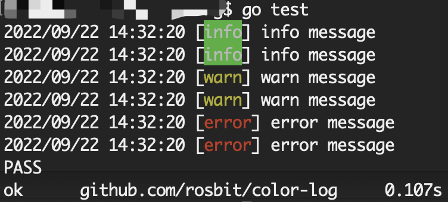

# simple color log

### Install

The package is fully go-getable, so, just type

  `go get github.com/rosbit/color-log`

to install.

### Usage

```go
package main

import (
  "github.com/rosbit/color-log"
  "fmt"
)

func main() {
	clog.Info("info message")
	clog.Infof("%s", "info message")
	clog.Warn("warn message")
	clog.Warnf("%s", "warn message")
	clog.Error("error message")
	clog.Errorf("%s", "error message")
}
```

### Test

  

